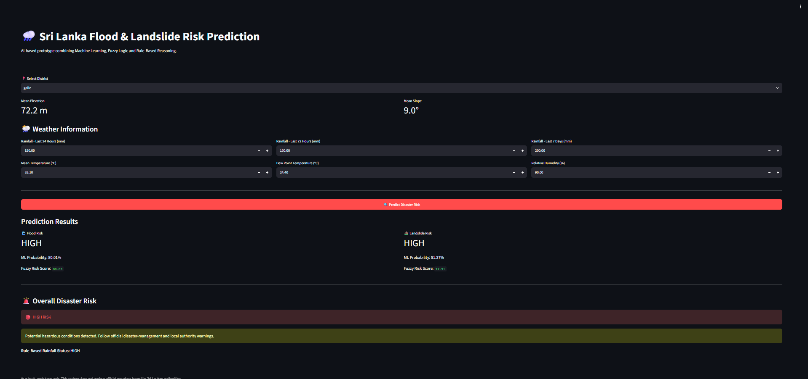
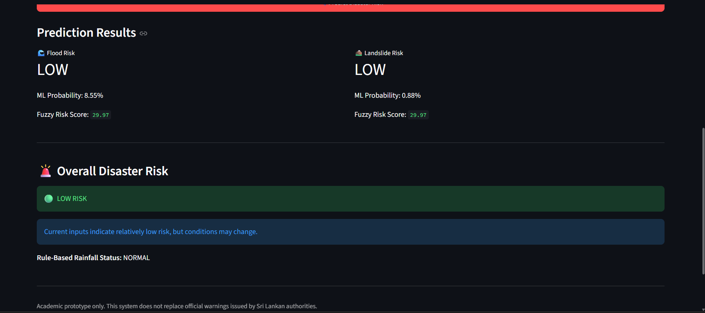
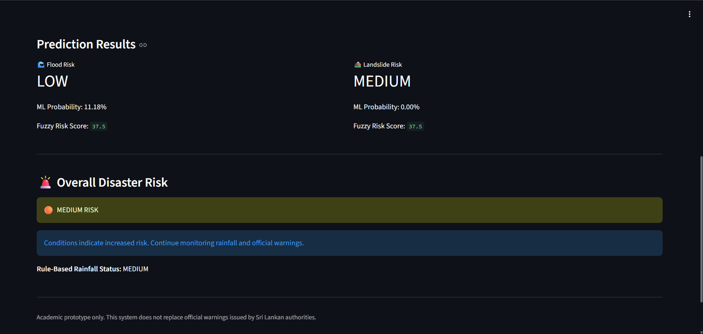
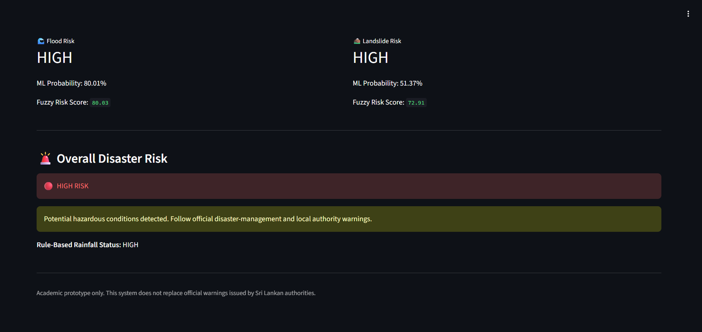

<div align="center">

# 🌧️ AI-Based Flood & Landslide Risk Prediction System

### An AI-powered disaster risk prediction and early warning prototype for Sri Lanka

**Machine Learning • Fuzzy Logic • Rule-Based Reasoning • Streamlit**


## 🚀 Live Demo

🌐 **Try the deployed application here:**  
[Open Flood & Landslide Risk Prediction System](https://sri-lanka-flood-landslide-risk-prediction.streamlit.app/)

</div>

---

## 📖 About the Project

Sri Lanka is frequently affected by **floods and landslides**, especially during periods of heavy rainfall. Early identification of potentially dangerous conditions can help improve disaster preparedness and awareness.

This project presents an **AI-based Flood and Landslide Risk Prediction and Early Warning Prototype** that combines multiple Artificial Intelligence techniques to estimate disaster risk.

The system integrates:

- 🤖 **Machine Learning**
- 🌫️ **Fuzzy Logic**
- 📋 **Rule-Based Reasoning**

Climate, rainfall and terrain information are processed to produce separate **Flood** and **Landslide** predictions together with an overall risk level.

> 🎓 This project was developed as a group project for the **Essentials of Artificial Intelligence** module.

---

## ✨ What the System Provides

The system generates:

- 🌊 Flood probability
- ⛰️ Landslide probability
- 🌊 Flood risk level
- ⛰️ Landslide risk level
- 🧠 Fuzzy risk scores
- 🌧️ Rainfall-based warning status
- 🚨 Overall disaster risk

Final risk levels are presented as:

**🟢 LOW | 🟡 MEDIUM | 🔴 HIGH**

---

## 🧠 AI Techniques Used

### 1️⃣ Machine Learning

Two classification algorithms were investigated:

- **Decision Tree**
- **Random Forest**

After evaluation, **Random Forest classifiers** were used as the final Machine Learning models for both flood and landslide prediction.

Two separate models are used:

```text
Environmental Data
       │
       ├────► Flood Random Forest ─────► Flood Probability
       │
       └────► Landslide Random Forest ─► Landslide Probability
```

---

### 2️⃣ Fuzzy Logic

Disaster risk cannot always be represented using strict boundaries.

Therefore, fuzzy logic is used to combine:

- 🌧️ Rainfall conditions
- ⛰️ Terrain slope
- 🤖 Machine Learning probability

The fuzzy system produces a numerical risk score that contributes to the final:

```text
LOW → MEDIUM → HIGH
```

risk classification.

---

### 3️⃣ Rule-Based Reasoning

A rainfall-based rule system provides an additional warning mechanism.

The prototype uses predefined rainfall thresholds to identify increasing rainfall severity.

This rule-based layer works together with the Machine Learning and Fuzzy Logic components when determining the final risk.

> **Note:** The rainfall thresholds used in this prototype are experimental project rules and should not be interpreted as official warning thresholds issued by Sri Lankan disaster-management authorities.

---

# 🏗️ System Architecture

```text
             ┌───────────────────────────┐
             │ Climate & Rainfall Data   │
             └─────────────┬─────────────┘
                           │
             ┌─────────────▼─────────────┐
             │ Historical Disaster Data  │
             └─────────────┬─────────────┘
                           │
             ┌─────────────▼─────────────┐
             │      Terrain Data         │
             │   Elevation + Slope       │
             └─────────────┬─────────────┘
                           │
                           ▼
             ┌───────────────────────────┐
             │ Data Preprocessing &      │
             │ Feature Engineering       │
             └─────────────┬─────────────┘
                           │
                 ┌─────────┴─────────┐
                 ▼                   ▼
        ┌────────────────┐  ┌──────────────────┐
        │ Flood Random   │  │ Landslide Random │
        │ Forest Model   │  │ Forest Model     │
        └───────┬────────┘  └────────┬─────────┘
                │                    │
                └─────────┬──────────┘
                          ▼
                ┌─────────────────┐
                │   Fuzzy Logic   │
                └────────┬────────┘
                         ▼
                ┌─────────────────┐
                │   Rule-Based    │
                │    Reasoning    │
                └────────┬────────┘
                         ▼
             ┌──────────────────────┐
             │ Final Risk Decision  │
             │ LOW / MEDIUM / HIGH  │
             └──────────┬───────────┘
                        ▼
                ┌───────────────┐
                │ Streamlit GUI │
                └───────────────┘
```

---

# 🖥️ System Interface

The prediction system is provided through an interactive **Streamlit web interface**.

Users can select a district and enter current environmental conditions before generating a risk prediction.

## 🏠 Main Prediction Interface



---

## 🟢 Low-Risk Prediction

Example output when the system identifies relatively low disaster risk.



---

## 🟡 Medium-Risk Prediction

Example output when environmental and model conditions indicate an increased level of risk.



---

## 🔴 High-Risk Prediction

Example output when the integrated system identifies potentially severe conditions.



---

# 📊 Machine Learning Performance

The dataset contains significantly more normal days than disaster-event days. Because of this **class imbalance**, accuracy alone is not sufficient for evaluating the models.

The final models were therefore also evaluated using:

- Precision
- Recall
- F1-score
- PR-AUC
- ROC-AUC
- Confusion Matrix

### Final Test Results

| Model | Threshold | Precision | Recall | F1 | ROC-AUC |
|---|---:|---:|---:|---:|---:|
| 🌊 Flood Random Forest | 0.70 | 0.1292 | 0.2547 | 0.1714 | **0.9150** |
| ⛰️ Landslide Random Forest | 0.80 | 0.1343 | 0.2727 | 0.1800 | **0.9287** |

The models show useful ranking ability based on ROC-AUC, while prediction of the rare positive disaster class remains challenging because of the strong class imbalance.

---

# 📂 Data & Features

The final Machine Learning models use **8 environmental features**:

| Feature | Description |
|---|---|
| `Rainfall_24h` | Rainfall during the last 24 hours |
| `Rainfall_72h` | Accumulated rainfall over 72 hours |
| `Rainfall_7day` | Accumulated rainfall over 7 days |
| `Mean_Temp_C` | Mean temperature |
| `Dew_Temp_C` | Dew-point temperature |
| `Relative_Humidity` | Relative humidity |
| `Mean_Elevation_m` | Mean district elevation |
| `Mean_Slope_deg` | Mean district terrain slope |

### Data Sources Used

## 🌍 Data Sources

The project combines historical climate, disaster-event and terrain information for Sri Lanka.

### 🌧️ Climate Data

Daily district-level climate data were used for the period **2007–2020**.

The climate variables include:

- Daily precipitation
- Mean temperature
- Dew-point temperature
- Derived relative humidity
- 24-hour accumulated rainfall
- 72-hour accumulated rainfall
- 7-day accumulated rainfall

Climate dataset repository:

🔗 [Sri Lanka District Climate Data](https://github.com/hsandamini/sri-lanka-district-climate-data)

### 🚨 Historical Disaster Data

Historical flood and landslide event records were obtained from the **DesInventar disaster information system**.

The records were cleaned and transformed into district-day binary target variables:

- `Flood`
- `Landslide`
- `Any_Disaster`

### 🛰️ Terrain Data

Terrain information was derived from **NASADEM Digital Elevation Model (DEM)** data.

The elevation raster was processed to calculate:

- Mean district elevation
- Mean district slope

District boundaries were then used to aggregate terrain information at district level.

> **Data preparation note:** Colombo was excluded from the final modelling dataset because its rainfall observations were unavailable for the study period. The final dataset therefore contains **122,736 district-day observations across 24 districts**.

# 🗓️ Model Development Strategy

To reduce temporal data leakage, the dataset was divided chronologically:

```text
Training       → 2007–2017
Validation     → 2018
Testing        → 2019–2020
```

The validation dataset was used during model selection and threshold evaluation, while the final period was retained for testing.

---

# 🔄 Prediction Workflow

When a user enters environmental conditions:

```text
User Inputs
     ↓
Prepare 8 ML Features
     ↓
Flood Random Forest
     ↓
Flood Probability
     
User Inputs
     ↓
Landslide Random Forest
     ↓
Landslide Probability
     
Probabilities + Rainfall + Slope
     ↓
Fuzzy Logic
     ↓
Rainfall Rule-Based Reasoning
     ↓
Flood Risk + Landslide Risk
     ↓
Overall Risk
     ↓
🟢 LOW / 🟡 MEDIUM / 🔴 HIGH
```

---

# 📁 Repository Structure

```text
sri-lanka-flood-landslide-risk-prediction/
│
├── 📂 app/
│   └── app.py
│
├── 📂 assets/
│   ├── gui_home.png
│   ├── low_risk_prediction.png
│   ├── medium_risk_prediction.png
│   └── high_risk_prediction.png
│
├── 📂 data/
│   └── district_terrain.csv
│
├── 📂 models/
│   ├── flood_random_forest.pkl
│   ├── landslide_random_forest.pkl
│   └── model_features.pkl
│
├── 📂 notebooks/
│   └── model_development.py
│
├── .gitignore
├── LICENSE
├── README.md
└── requirements.txt
```

---

# 🚀 Running the Project

### 1. Clone the repository

```bash
git clone https://github.com/Hasiya-03/sri-lanka-flood-landslide-risk-prediction.git
```

Move into the project directory:

```bash
cd sri-lanka-flood-landslide-risk-prediction
```

### 2. Install dependencies

```bash
pip install -r requirements.txt
```

### 3. Start the Streamlit application

```bash
streamlit run app/app.py
```

The application will then open in your browser.

---

# 🛠️ Technologies Used

| Technology | Purpose |
|---|---|
| 🐍 Python | Main programming language |
| 🐼 Pandas | Data processing |
| 🔢 NumPy | Numerical operations |
| 🤖 Scikit-learn | Machine Learning |
| 🌫️ Scikit-Fuzzy | Fuzzy Logic |
| 💾 Joblib | Model storage/loading |
| 🎈 Streamlit | Web-based user interface |
| 📓 Google Colab / Jupyter | Model development |
| 🗺️ NASADEM | Terrain elevation information |

---

# ⚠️ Current Limitations

This system is an **academic prototype** and has several limitations.

The historical dataset is highly imbalanced because disaster events are rare compared with normal days. This makes accurate prediction of the positive disaster class challenging.

Colombo was excluded from Machine Learning model development because the rainfall series required for the study period was unavailable in the prepared dataset.

The system also uses district-level terrain averages, which cannot capture every local geographical variation within a district.

Further testing and improvement would be required before considering any real-world operational use.

---

# 🔮 Future Improvements

Possible future developments include:

- 📡 Integration with real-time rainfall/weather APIs
- 🗺️ More detailed location-level predictions
- 🛰️ Additional satellite and terrain information
- 📈 Larger and more balanced disaster datasets
- 🧠 Evaluation of additional Machine Learning models
- 🔔 Automated warning notifications
- 📱 Mobile-friendly disaster alerts
- 🗺️ Interactive risk maps

---

# 👥 Team Project

## 👥 Project Team

This project was developed collaboratively as part of the **Essentials of Artificial Intelligence** module at the **General Sir John Kotelawala Defence University (KDU)**.

### Group 18

| Team Member | Degree Area |
|---|---|
| NAH Dilshan | Data Science and Business Analytics |
| GPN Kaushalya | Information Systems |
| AM Weerasinghe | Information Technology |
| DKNL Jayawardhana | Computer Science |

The project involved collaborative work across:

**Data Collection • Data Preprocessing • Feature Engineering • Terrain Processing • Machine Learning • Fuzzy Logic • Rule-Based Reasoning • Streamlit Development • Testing • Documentation**

## 📌 Project Status

**Version:** 1.0  
**Status:** ✅ Prototype Completed

The current version includes:

- ✅ Flood Random Forest model
- ✅ Landslide Random Forest model
- ✅ Fuzzy risk assessment
- ✅ Rainfall-based rule reasoning
- ✅ Integrated LOW / MEDIUM / HIGH risk classification
- ✅ District terrain information
- ✅ Streamlit graphical interface
- ✅ Online Streamlit deployment
- ✅ Historical test-data evaluation

Future development may include real-time weather integration, finer spatial resolution, additional training data and expert validation.

# ⚠️ Disclaimer

> This project is intended for **academic and research purposes only**.
>
> Predictions generated by this prototype should **not** be used as official disaster warnings or as a replacement for information provided by Sri Lankan disaster-management and meteorological authorities.

---

<div align="center">

### 🌧️ AI for Disaster Risk Awareness 🇱🇰

**Machine Learning × Fuzzy Logic × Rule-Based Reasoning**

Made as an academic Artificial Intelligence project.

</div>
